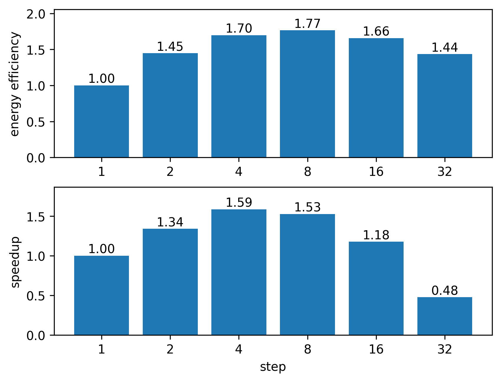
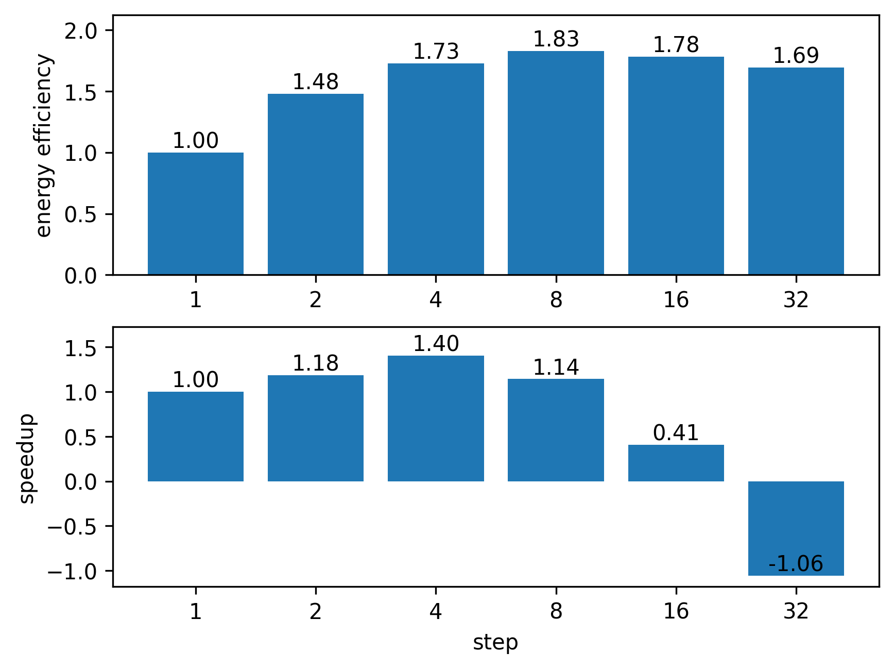
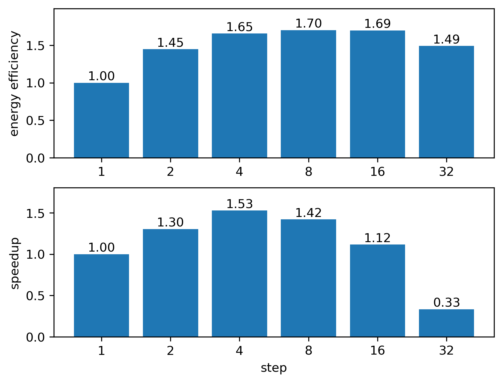
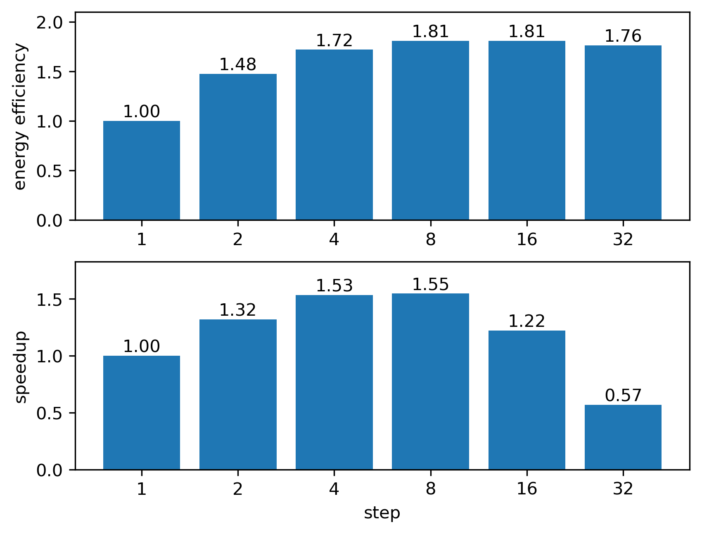
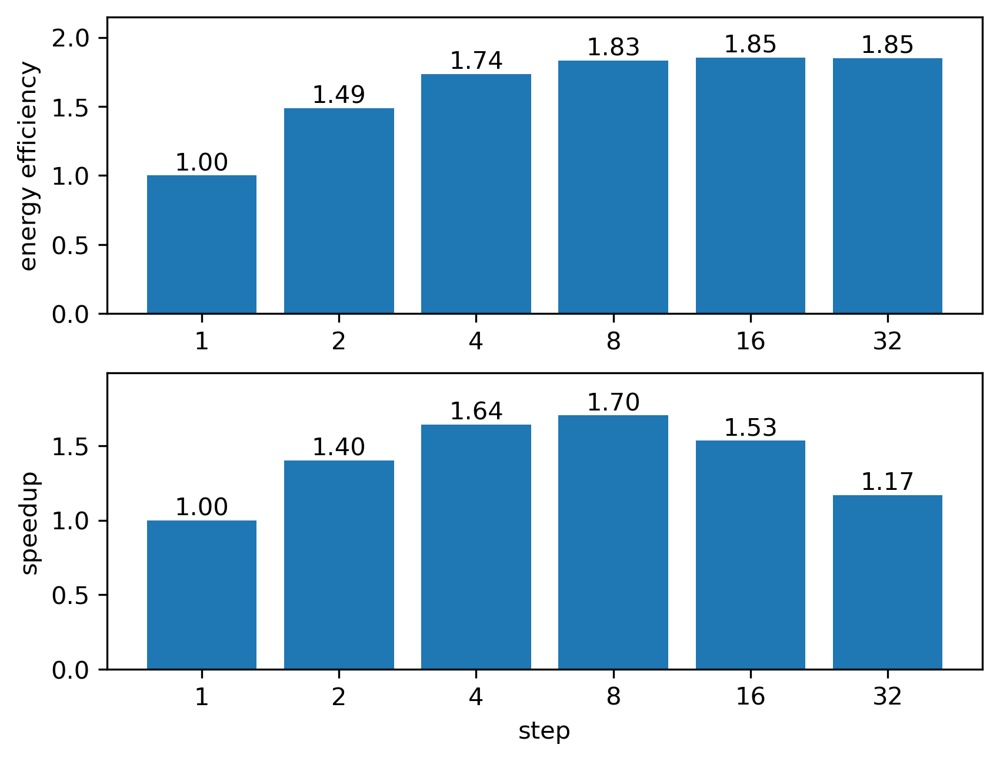

## Description

用于评估存算一体加速器中利用SNN进行稀疏加速的效果评估。

## User Guide

运行示例：

```bash
run_demo.sh MNIST train
run_demo.sh MNIST infer
# visualize the results in `codes/timestep_skip_evaluation.ipynb`
```

## Network Architecture

### MNIST

```python
MNISTNet(
  (boost): AvgPool1d(kernel_size=(10,), stride=(10,), padding=(0,))
  (static_conv): Sequential(
    (0): Conv2d(1, 128, kernel_size=(3, 3), stride=(1, 1), padding=(1, 1), bias=False)
    (1): BatchNorm2d(128, eps=1e-05, momentum=0.1, affine=True, track_running_stats=True)
  )
  (conv): Sequential(
    (0): PLIFNode(
      v_threshold=1.0, v_reset=0.0, tau=1.3741859177448472
      (surrogate_function): ATan(alpha=2.0, spiking=True, learnable=False)
    )
    (1): MaxPool2d(kernel_size=2, stride=2, padding=0, dilation=1, ceil_mode=False)
    (2): Conv2d(128, 128, kernel_size=(3, 3), stride=(1, 1), padding=(1, 1), bias=False)
    (3): BatchNorm2d(128, eps=1e-05, momentum=0.1, affine=True, track_running_stats=True)
    (4): PLIFNode(
      v_threshold=1.0, v_reset=0.0, tau=1.4618923459153326
      (surrogate_function): ATan(alpha=2.0, spiking=True, learnable=False)
    )
    (5): MaxPool2d(kernel_size=2, stride=2, padding=0, dilation=1, ceil_mode=False)
  )
  (fc): Sequential(
    (0): Flatten(start_dim=1, end_dim=-1)
    (1): Dropout(p=0.5, dropout_spikes=True)
    (2): Linear(in_features=6272, out_features=2048, bias=False)
    (3): PLIFNode(
      v_threshold=1.0, v_reset=0.0, tau=5.107290222741289
      (surrogate_function): ATan(alpha=2.0, spiking=True, learnable=False)
    )
    (4): Dropout(p=0.5, dropout_spikes=True)
    (5): Linear(in_features=2048, out_features=100, bias=False)
    (6): PLIFNode(
      v_threshold=1.0, v_reset=0.0, tau=1.7127899464802145
      (surrogate_function): ATan(alpha=2.0, spiking=True, learnable=False)
    )
  )
)
```

### CIFAR10

```python
Cifar10Net(
  (boost): AvgPool1d(kernel_size=(10,), stride=(10,), padding=(0,))
  (static_conv): Sequential(
    (0): Conv2d(3, 256, kernel_size=(3, 3), stride=(1, 1), padding=(1, 1), bias=False)
    (1): BatchNorm2d(256, eps=1e-05, momentum=0.1, affine=True, track_running_stats=True)
  )
  (conv): Sequential(
    (0): PLIFNode(
      v_threshold=1.0, v_reset=0.0, tau=1.7022646819580023
      (surrogate_function): ATan(alpha=2.0, spiking=True, learnable=False)
    )
    (1): Conv2d(256, 256, kernel_size=(3, 3), stride=(1, 1), padding=(1, 1), bias=False)
    (2): BatchNorm2d(256, eps=1e-05, momentum=0.1, affine=True, track_running_stats=True)
    (3): PLIFNode(
      v_threshold=1.0, v_reset=0.0, tau=1.3558013481229096
      (surrogate_function): ATan(alpha=2.0, spiking=True, learnable=False)
    )
    (4): Conv2d(256, 256, kernel_size=(3, 3), stride=(1, 1), padding=(1, 1), bias=False)
    (5): BatchNorm2d(256, eps=1e-05, momentum=0.1, affine=True, track_running_stats=True)
    (6): PLIFNode(
      v_threshold=1.0, v_reset=0.0, tau=1.5110598574468435
      (surrogate_function): ATan(alpha=2.0, spiking=True, learnable=False)
    )
    (7): MaxPool2d(kernel_size=2, stride=2, padding=0, dilation=1, ceil_mode=False)
    (8): Conv2d(256, 256, kernel_size=(3, 3), stride=(1, 1), padding=(1, 1), bias=False)
    (9): BatchNorm2d(256, eps=1e-05, momentum=0.1, affine=True, track_running_stats=True)
    (10): PLIFNode(
      v_threshold=1.0, v_reset=0.0, tau=1.3839423346361983
      (surrogate_function): ATan(alpha=2.0, spiking=True, learnable=False)
    )
    (11): Conv2d(256, 256, kernel_size=(3, 3), stride=(1, 1), padding=(1, 1), bias=False)
    (12): BatchNorm2d(256, eps=1e-05, momentum=0.1, affine=True, track_running_stats=True)
    (13): PLIFNode(
      v_threshold=1.0, v_reset=0.0, tau=1.449084847804864
      (surrogate_function): ATan(alpha=2.0, spiking=True, learnable=False)
    )
    (14): Conv2d(256, 256, kernel_size=(3, 3), stride=(1, 1), padding=(1, 1), bias=False)
    (15): BatchNorm2d(256, eps=1e-05, momentum=0.1, affine=True, track_running_stats=True)
    (16): PLIFNode(
      v_threshold=1.0, v_reset=0.0, tau=1.5846861049933358
      (surrogate_function): ATan(alpha=2.0, spiking=True, learnable=False)
    )
    (17): MaxPool2d(kernel_size=2, stride=2, padding=0, dilation=1, ceil_mode=False)
  )
  (fc): Sequential(
    (0): Flatten(start_dim=1, end_dim=-1)
    (1): Dropout(p=0.5, dropout_spikes=True)
    (2): Linear(in_features=16384, out_features=2048, bias=False)
    (3): PLIFNode(
      v_threshold=1.0, v_reset=0.0, tau=12.670267555608001
      (surrogate_function): ATan(alpha=2.0, spiking=True, learnable=False)
    )
    (4): Linear(in_features=2048, out_features=100, bias=False)
    (5): PLIFNode(
      v_threshold=1.0, v_reset=0.0, tau=1.5511847868426607
      (surrogate_function): ATan(alpha=2.0, spiking=True, learnable=False)
    )
  )
)
```

### NMNIST

```python
NMNISTNet(
  (boost): AvgPool1d(kernel_size=(10,), stride=(10,), padding=(0,))
  (conv): Sequential(
    (0): Conv2d(2, 128, kernel_size=(3, 3), stride=(1, 1), padding=(1, 1), bias=False)
    (1): BatchNorm2d(128, eps=1e-05, momentum=0.1, affine=True, track_running_stats=True)
    (2): PLIFNode(
      v_threshold=1.0, v_reset=0.0, tau=1.3141555928596769
      (surrogate_function): ATan(alpha=2.0, spiking=True, learnable=False)
    )
    (3): MaxPool2d(kernel_size=2, stride=2, padding=0, dilation=1, ceil_mode=False)
    (4): Conv2d(128, 128, kernel_size=(3, 3), stride=(1, 1), padding=(1, 1), bias=False)
    (5): BatchNorm2d(128, eps=1e-05, momentum=0.1, affine=True, track_running_stats=True)
    (6): PLIFNode(
      v_threshold=1.0, v_reset=0.0, tau=2.1533399056608737
      (surrogate_function): ATan(alpha=2.0, spiking=True, learnable=False)
    )
    (7): MaxPool2d(kernel_size=2, stride=2, padding=0, dilation=1, ceil_mode=False)
  )
  (fc): Sequential(
    (0): Flatten(start_dim=1, end_dim=-1)
    (1): Dropout(p=0.5, dropout_spikes=False)
    (2): Linear(in_features=8192, out_features=2048, bias=False)
    (3): PLIFNode(
      v_threshold=1.0, v_reset=0.0, tau=7.665489771520904
      (surrogate_function): ATan(alpha=2.0, spiking=True, learnable=False)
    )
    (4): Dropout(p=0.5, dropout_spikes=True)
    (5): Linear(in_features=2048, out_features=100, bias=False)
    (6): PLIFNode(
      v_threshold=1.0, v_reset=0.0, tau=4.277552660490297
      (surrogate_function): ATan(alpha=2.0, spiking=True, learnable=False)
    )
  )
)
```

### CIFAR10DVS

```python
CIFAR10DVSNet(
  (boost): AvgPool1d(kernel_size=(10,), stride=(10,), padding=(0,))
  (conv): Sequential(
    (0): Conv2d(2, 128, kernel_size=(3, 3), stride=(1, 1), padding=(1, 1), bias=False)
    (1): BatchNorm2d(128, eps=1e-05, momentum=0.1, affine=True, track_running_stats=True)
    (2): PLIFNode(
      v_threshold=1.0, v_reset=0.0, tau=1.5149372041014115
      (surrogate_function): ATan(alpha=2.0, spiking=True, learnable=False)
    )
    (3): MaxPool2d(kernel_size=2, stride=2, padding=0, dilation=1, ceil_mode=False)
    (4): Conv2d(128, 128, kernel_size=(3, 3), stride=(1, 1), padding=(1, 1), bias=False)
    (5): BatchNorm2d(128, eps=1e-05, momentum=0.1, affine=True, track_running_stats=True)
    (6): PLIFNode(
      v_threshold=1.0, v_reset=0.0, tau=1.633092926434282
      (surrogate_function): ATan(alpha=2.0, spiking=True, learnable=False)
    )
    (7): MaxPool2d(kernel_size=2, stride=2, padding=0, dilation=1, ceil_mode=False)
    (8): Conv2d(128, 128, kernel_size=(3, 3), stride=(1, 1), padding=(1, 1), bias=False)
    (9): BatchNorm2d(128, eps=1e-05, momentum=0.1, affine=True, track_running_stats=True)
    (10): PLIFNode(
      v_threshold=1.0, v_reset=0.0, tau=1.4339046172125653
      (surrogate_function): ATan(alpha=2.0, spiking=True, learnable=False)
    )
    (11): MaxPool2d(kernel_size=2, stride=2, padding=0, dilation=1, ceil_mode=False)
    (12): Conv2d(128, 128, kernel_size=(3, 3), stride=(1, 1), padding=(1, 1), bias=False)
    (13): BatchNorm2d(128, eps=1e-05, momentum=0.1, affine=True, track_running_stats=True)
    (14): PLIFNode(
      v_threshold=1.0, v_reset=0.0, tau=1.3371331857407665
      (surrogate_function): ATan(alpha=2.0, spiking=True, learnable=False)
    )
    (15): MaxPool2d(kernel_size=2, stride=2, padding=0, dilation=1, ceil_mode=False)
  )
  (fc): Sequential(
    (0): Flatten(start_dim=1, end_dim=-1)
    (1): Dropout(p=0.5, dropout_spikes=False)
    (2): Linear(in_features=8192, out_features=2048, bias=False)
    (3): PLIFNode(
      v_threshold=1.0, v_reset=0.0, tau=3.8100863225407635
      (surrogate_function): ATan(alpha=2.0, spiking=True, learnable=False)
    )
    (4): Dropout(p=0.5, dropout_spikes=True)
    (5): Linear(in_features=2048, out_features=100, bias=False)
    (6): PLIFNode(
      v_threshold=1.0, v_reset=0.0, tau=1.0508333213283785
      (surrogate_function): ATan(alpha=2.0, spiking=True, learnable=False)
    )
  )
)
```

### DVS128Gesture

```python
DVS128GestureNet(
  (boost): AvgPool1d(kernel_size=(10,), stride=(10,), padding=(0,))
  (conv): Sequential(
    (0): Conv2d(2, 128, kernel_size=(3, 3), stride=(1, 1), padding=(1, 1), bias=False)
    (1): BatchNorm2d(128, eps=1e-05, momentum=0.1, affine=True, track_running_stats=True)
    (2): PLIFNode(
      v_threshold=1.0, v_reset=0.0, tau=1.825888826492188
      (surrogate_function): ATan(alpha=2.0, spiking=True, learnable=False)
    )
    (3): MaxPool2d(kernel_size=2, stride=2, padding=0, dilation=1, ceil_mode=False)
    (4): Conv2d(128, 128, kernel_size=(3, 3), stride=(1, 1), padding=(1, 1), bias=False)
    (5): BatchNorm2d(128, eps=1e-05, momentum=0.1, affine=True, track_running_stats=True)
    (6): PLIFNode(
      v_threshold=1.0, v_reset=0.0, tau=1.7871365321923303
      (surrogate_function): ATan(alpha=2.0, spiking=True, learnable=False)
    )
    (7): MaxPool2d(kernel_size=2, stride=2, padding=0, dilation=1, ceil_mode=False)
    (8): Conv2d(128, 128, kernel_size=(3, 3), stride=(1, 1), padding=(1, 1), bias=False)
    (9): BatchNorm2d(128, eps=1e-05, momentum=0.1, affine=True, track_running_stats=True)
    (10): PLIFNode(
      v_threshold=1.0, v_reset=0.0, tau=1.8914105116291444
      (surrogate_function): ATan(alpha=2.0, spiking=True, learnable=False)
    )
    (11): MaxPool2d(kernel_size=2, stride=2, padding=0, dilation=1, ceil_mode=False)
    (12): Conv2d(128, 128, kernel_size=(3, 3), stride=(1, 1), padding=(1, 1), bias=False)
    (13): BatchNorm2d(128, eps=1e-05, momentum=0.1, affine=True, track_running_stats=True)
    (14): PLIFNode(
      v_threshold=1.0, v_reset=0.0, tau=1.8545206578472782
      (surrogate_function): ATan(alpha=2.0, spiking=True, learnable=False)
    )
    (15): MaxPool2d(kernel_size=2, stride=2, padding=0, dilation=1, ceil_mode=False)
    (16): Conv2d(128, 128, kernel_size=(3, 3), stride=(1, 1), padding=(1, 1), bias=False)
    (17): BatchNorm2d(128, eps=1e-05, momentum=0.1, affine=True, track_running_stats=True)
    (18): PLIFNode(
      v_threshold=1.0, v_reset=0.0, tau=1.631267030025739
      (surrogate_function): ATan(alpha=2.0, spiking=True, learnable=False)
    )
    (19): MaxPool2d(kernel_size=2, stride=2, padding=0, dilation=1, ceil_mode=False)
  )
  (fc): Sequential(
    (0): Flatten(start_dim=1, end_dim=-1)
    (1): Dropout(p=0.5, dropout_spikes=False)
    (2): Linear(in_features=2048, out_features=512, bias=False)
    (3): PLIFNode(
      v_threshold=1.0, v_reset=0.0, tau=1.7311361522034685
      (surrogate_function): ATan(alpha=2.0, spiking=True, learnable=False)
    )
    (4): Dropout(p=0.5, dropout_spikes=True)
    (5): Linear(in_features=512, out_features=110, bias=False)
    (6): PLIFNode(
      v_threshold=1.0, v_reset=0.0, tau=1.4245185550981094
      (surrogate_function): ATan(alpha=2.0, spiking=True, learnable=False)
    )
  )
)
```

## Update Log

### Date: 2024-08-15

- 使用`pyinstall NeuroSim.spec`进行打包，可以直接使用安装包`dist`运行实验。但是打包版本多进程加速存在问题，会导致无限产生新的进程，因此取消了多进程加速。

### Date: 2024-03-05

- resnet中下采样层在网络结构中netStrucure[layer, -2]=2，并且TS=0(netStructure[layer, -1]=0)
- 在hook中已经讲下采样层给屏蔽，PyNeuroSim中不需要考虑下采样，但是下采样的判断仍然保留
- SNN层Accumulator的位宽进行了修正
- 增加了popcnt的性能拟合和输出
- 修改为仅解析SNN layer output
- 激活阵列的行方向能耗进行了修正，无论多少次复用，只计算一次全阵列能耗

### Date: 2024-02-29

- 修正DFF的反转率(gamma)：从0.5到0.17，这是对标DC的功耗结果
- 复制逻辑使crossbar的占用率最高
- 修正SNN Layer的buffer size
- CIFAR10DVS支持单机多卡训练

### Date: 2024-02-22

- 修正utils.py中`LoadInSnnInputData`函数，不在此处执行sum，而是发送原始数据到SubArray中。
- 支持SubArray粒度和Column粒度处理模式（近似结果）

### Date: 2024-02-22

- wlNewSwitch中DFF能耗过高，修改其中DFF的个数为0
- 更正self.shiftAddInput位宽
- 增加命令行argparser，这样可以在命令行中override一些控制参数

TODO:

<!-- - shiftAddWeight和shiftAddInput能耗过高，其中移位寄存器太多，并且默认反转率为0.5。 -->
<!-- - 复制逻辑使crossbar的占用率最高 -->
- 修正recover的能耗评估，SL/WL的switch的动态功耗没有
<!-- - 对比阵列激活和按列激活两种方案，应该是按列激活效果更好。这样baseline还是多比特pack，然后非加权（time window）输入。列方案则采用popcnt加权+recover的机制实现。 -->
<!-- - 优化buffer size for snn layer -->
- 实现snn_sram分支
- 实现snn_systolicarray分支，参考[^1],[^2]

### Date: 2024-02-17

- 修复Chip中padding计算的问题，固定为1
- 修复各个模块中对于output的切分问题，考虑到numColPerSynapse
- Subarray中使用denseRatio粗略估计recover所需的能耗和延迟（能耗高估了）
<!-- - 使用Status单例中的denseRatioList进行统计，因此无法使用多进程进行加速，在统计denseRatio分布时需要关闭多进程加速，但是对性能评估不影响 -->
- LoadInSnnInputData中输入处理进行修正，注释见函数
- write_matrix_output_fc中输出保存的维度顺序进行修正

### Date: 2024-01-29

- 在main分支下实现支持DNN的代码
- 在snn分支下实现支持SNN的代码
- LeakagePower都还存在问题
- 对于仍未实现的功能，由于增加了初始化中的isSNN参数，因此暂无法保证所有的对象都初始化正确
- 在NetWork_xxx.csv文件中，增加两个属性：<isSNN> <Timestep>
- 现在硬件性能评估时，执行SNN计算单元的内部位宽是由SNN决定的，这是不合理的，应该由所支持的最高位宽决定。当然也可以在芯片中设置不同位宽的chiplet，也是没有问题的，CNN用高位宽chiplet，SNN用低位宽chiplet，这样可以减少SNN的能耗。如果要非常合理的支持CNN/SNN随机layout，还是应该在硬件单元初始化时使用self.param.numBitInput，而在计算延迟pulse和输入数据切分时使用self.numBitInput。

### Date: 2024-01-05

- 实现三个基础类：Param, Technology, MemCell 
- 这三个类实现在__init__中统一初始化，避免了NeuroSim中到处赋值的混乱。
- 后续需要更新的参数，例如`speedUpDegree`，可以通过`update()`方法进行更新，其中进行了强检查。

### Date: 2023-12-27

- 实现`codes/hooks.py`，用于在`codes/infer_val.py`中调用`hook`保存仿真所需的中间结果。
- `codes/timestep_skip_evaluation.ipynb`中实现结果可视化
- MNIST数据集上的结果如下图所示：
	
- CIFAR10数据集上的结果如下图所示：
	
- NMNIST数据集上的结果如下图所示：
	
- CIFAR10DVS数据集上的结果如下图所示：
	
- DVS128Gesture数据集上的结果如下图所示：
	

## TODO: 

- FC层和Conv层使用同样的step参数，但是Cout较大，导致hit rate很低。因此需要采用不同的step参数。
- 可以使用动态step参数，不同conv层的Cout不同需要设置step参数不同，此外，可以根据前几次的pattern预测后续的step，类似预取的基于历史pattern预测。
- 在hook中量化，以实现在hardware evaluation阶段获得更准确的能耗估计。
- 在inference时，考虑硬件量化的精度。
- 现在python程序中计时只考虑了串行执行所有层的总时间，没有考虑到pipeline。
- 按照不同层的多进程加速，而不是层间

## spikingjelly 代码patch

由于采用了cuda 11.8的python环境，因此需要对spikingjelly的代码进行patch，使其能够正常运行。

1. 按照`Parametric-Leaky-Integrate-and-Fire`的说明，将`spikingjelly`的代码回退到固定版本。

```
git reset --hard 73f94ab983d0167623015537f7d4460b064cfca1
```

2. 对`spikingjelly`仓库进行patch，使其能够正常运行，patch文件为`cuda_11.8.patch`，使用如下命令进行patch：

```
git apply cuda_11.8.patch
```

3. 安装`spikingjelly`。

```
python setup.py install
```

此外，如果使用docker环境运行该代码，由于python使用共享内存进行线程数据共享，因此需要设置docker容器的shm_size足够大。

> https://github.com/fangwei123456/spikingjelly/issues/472

## Appendix I: spikingjelly代码patch

```
diff --git a/spikingjelly/datasets/cifar10_dvs.py b/spikingjelly/datasets/cifar10_dvs.py
index bbbd128..84b48ad 100644
--- a/spikingjelly/datasets/cifar10_dvs.py
+++ b/spikingjelly/datasets/cifar10_dvs.py
@@ -108,7 +108,7 @@ def parse_raw_address(addr,
                       y_shift=y_shift,
                       polarity_mask=polarity_mask,
                       polarity_shift=polarity_shift):
-    polarity = read_bits(addr, polarity_mask, polarity_shift).astype(np.bool)
+    polarity = read_bits(addr, polarity_mask, polarity_shift).astype(np.bool_)
     x = read_bits(addr, x_mask, x_shift)
     y = read_bits(addr, y_mask, y_shift)
     return x, y, polarity
@@ -143,7 +143,8 @@ class CIFAR10DVS(EventsFramesDatasetBase):
         for key in resource.keys():
             file_name = os.path.join(download_root, key + '.zip')
             if os.path.exists(file_name):
-                if utils.check_md5(file_name, resource[key][1]):
+                # if utils.check_md5(file_name, resource[key][1]):
+                if True:
                     print(f'extract {file_name} to {extract_root}')
                     utils.extract_archive(file_name, extract_root)
                 else:
diff --git a/spikingjelly/datasets/dvs128_gesture.py b/spikingjelly/datasets/dvs128_gesture.py
index 7bcc726..5be9911 100644
--- a/spikingjelly/datasets/dvs128_gesture.py
+++ b/spikingjelly/datasets/dvs128_gesture.py
@@ -41,7 +41,8 @@ class DVS128Gesture(EventsFramesDatasetBase):
         file_name = os.path.join(download_root, 'DvsGesture.tar.gz')
         if os.path.exists(file_name):
             print('DvsGesture.tar.gz already exists, check md5')
-            if utils.check_md5(file_name, resource[1]):
+            # if utils.check_md5(file_name, resource[1]):
+            if True:
                 print('md5 checked, extracting...')
                 utils.extract_archive(file_name, extract_root)
                 return
diff --git a/spikingjelly/datasets/speechcommands.py b/spikingjelly/datasets/speechcommands.py
index 698a944..14cb73f 100644
--- a/spikingjelly/datasets/speechcommands.py
+++ b/spikingjelly/datasets/speechcommands.py
@@ -1,15 +1,18 @@
 import os
-from typing import Tuple
+from typing import Callable, Tuple, Dict, Optional
+from pathlib import Path
 
+import torch
 import torchaudio
 from torch.utils.data import Dataset
 from torch import Tensor
-from torchaudio.datasets.utils import (
+from torchvision.datasets.utils import (
     download_url,
-    extract_archive,
-    walk_files
+    extract_archive
 )
 from torchvision.datasets.utils import verify_str_arg
+import numpy as np
+from random import choice
 
 FOLDER_IN_ARCHIVE = "SpeechCommands"
 URL = "speech_commands_v0.02"
@@ -41,14 +44,26 @@ def load_speechcommands_item(relpath: str, path: str) -> Tuple[Tensor, int, str,
 
 class SPEECHCOMMANDS(Dataset):
     def __init__(self,
+                 label_dict: Dict,
                  root: str,
-                 url: str = URL,
-                 split: str = "train",
-                 folder_in_archive: str = FOLDER_IN_ARCHIVE,
-                 download: bool = False) -> None:
+                 silence_cnt: Optional[int] = 0,
+                 silence_size: Optional[int] = 16000,
+                 transform: Optional[Callable] = None,
+                 url: Optional[str] = URL,
+                 split: Optional[str] = "train",
+                 folder_in_archive: Optional[str] = FOLDER_IN_ARCHIVE,
+                 download: Optional[bool] = False) -> None:
         '''
+        :param label_dict: 标签与类别的对应字典
+        :type label_dict: Dict
         :param root: 数据集的根目录
         :type root: str
+        :param silence_cnt: Silence数据的数量
+        :type silence_cnt: int, optional
+        :param silence_size: Silence数据的尺寸
+        :type silence_size: int, optional
+        :param transform: A function/transform that takes in a raw audio
+        :type transform: Callable, optional
         :param url: 数据集版本，默认为v0.02
         :type url: str, optional
         :param split: 数据集划分，可以是 ``"train", "test", "val"``，默认为 ``"train"``
@@ -66,12 +81,23 @@ class SPEECHCOMMANDS(Dataset):
 
         #. 0~9的数字，共10个："One", "Two", "Three", "Four", "Five", "Six", "Seven", "Eight", "Nine".
 
-        #. 非关键词，可以视为干扰词，共10个："Bed", "Bird", "Cat", "Dog", "Happy", "House", "Marvin", "Sheila", "Tree", "Wow".
+        #. 辅助词，可以视为干扰词，共10个："Bed", "Bird", "Cat", "Dog", "Happy", "House", "Marvin", "Sheila", "Tree", "Wow".
 
         v0.01版本包含共计30类，64,727个音频片段，v0.02版本包含共计35类，105,829个音频片段。更详细的介绍参见前述论文，以及数据集的README。
+
+        代码实现基于torchaudio并扩充了功能，同时也参考了 `原论文的实现 <https://github.com/romainzimmer/s2net/blob/b073f755e70966ef133bbcd4a8f0343354f5edcd/data.py>`_。
         '''
 
         self.split = verify_str_arg(split, "split", ("train", "val", "test"))
+        self.label_dict = label_dict
+        self.transform = transform
+        self.silence_cnt = silence_cnt
+        self.silence_size = silence_size
+
+        if silence_cnt < 0:
+            raise ValueError(f"Invalid silence_cnt parameter: {silence_cnt}")
+        if silence_size <= 0:
+            raise ValueError(f"Invalid silence_size parameter: {silence_size}")
         
         if url in [
             "speech_commands_v0.01",
@@ -90,11 +116,13 @@ class SPEECHCOMMANDS(Dataset):
 
         self._path = os.path.join(root, folder_in_archive)
 
+        self.noise_list = sorted(str(p) for p in Path(self._path).glob('_background_noise_/*.wav'))
+
         if download:
             if not os.path.isdir(self._path):
                 if not os.path.isfile(archive):
                     checksum = _CHECKSUMS.get(url, None)
-                    download_url(url, root, hash_value=checksum, hash_type="md5")
+                    download_url(url, root, md5=checksum)
                 extract_archive(archive, self._path)
         elif not os.path.isdir(self._path):
             raise FileNotFoundError("Audio data not found. Please specify \"download=True\" and try again.")
@@ -107,7 +135,7 @@ class SPEECHCOMMANDS(Dataset):
                     self._walker = list([line.rstrip('\n') for line in f])
             else:
                 print("No training list, generating...")
-                walker = walk_files(self._path, suffix=".wav", prefix=True)
+                walker = sorted(str(p) for p in Path(self._path).glob('*/*.wav'))
                 walker = filter(lambda w: HASH_DIVIDER in w and EXCEPT_FOLDER not in w, walker)
                 walker = map(lambda w: os.path.relpath(w, self._path), walker)
 
@@ -129,6 +157,17 @@ class SPEECHCOMMANDS(Dataset):
 
                 print("Training list generated!")
 
+            labels = [self.label_dict.get(os.path.split(relpath)[0]) for relpath in self._walker]
+            label_weights = 1. / np.unique(labels, return_counts=True)[1]
+            if self.silence_cnt == 0:
+                label_weights /= np.sum(label_weights)
+                self.weights = torch.DoubleTensor([label_weights[label] for label in labels])
+            else:
+                silence_weight = 1. / self.silence_cnt
+                total_weight = np.sum(label_weights) + silence_weight
+                label_weights /= total_weight
+                self.weights = torch.DoubleTensor([label_weights[label] for label in labels] + [silence_weight / total_weight] * self.silence_cnt)
+
         else:
             if self.split == "val":
                 record = os.path.join(self._path, VAL_RECORD)
@@ -137,9 +176,30 @@ class SPEECHCOMMANDS(Dataset):
             with open(record, 'r') as f:
                 self._walker = list([line.rstrip('\n') for line in f])
 
-    def __getitem__(self, n: int) -> Tuple[Tensor, int, str, str, int]:
-        fileid = self._walker[n]
-        return load_speechcommands_item(fileid, self._path)
+    def __getitem__(self, n: int) -> Tuple[Tensor, int]:
+        if n < len(self._walker):
+            fileid = self._walker[n]
+            waveform, sample_rate, label, speaker_id, utterance_number = load_speechcommands_item(fileid, self._path)
+        else:
+            # Silence data are randomly and dynamically generated from noise data
+
+            # Load random noise
+            noisepath = choice(self.noise_list)
+            waveform, sample_rate = torchaudio.load(noisepath)
+
+            # Random crop
+            offset = np.random.randint(waveform.shape[1] - self.silence_size)
+            waveform = waveform[:, offset:offset + self.silence_size]
+            label = "_silence_"
+
+        m = waveform.abs().max()
+        if m > 0:
+            waveform /= m
+        if self.transform is not None:
+            waveform = self.transform(waveform)
+
+        label = self.label_dict.get(label)
+        return waveform, label
 
     def __len__(self) -> int:
-        return len(self._walker)
\ No newline at end of file
+        return len(self._walker) + self.silence_cnt
\ No newline at end of file
```


[^1]: https://github.com/scalesim-project/scale-sim-v2
[^2]: https://scalesim-project.github.io/